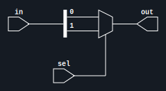
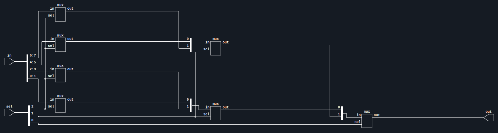

# Verilog Parameterized Multiplexer

[](https://github.com/gpu-enjoyer/mux-n/actions/workflows/test.yml)
[](https://github.com/gpu-enjoyer/mux-n/actions/workflows/lint.yml)  


## Project Description

This project implements a parameterized multiplexer in Verilog, allowing flexible configuration of input width and count.  
The design demonstrates the use of SystemVerilog parameters to create scalable hardware components.  

`N` represents the number of selector `sel` bits.  

Cocotb-based testbenches are located in the code_tb directory.  
For `mux` and `mux_n (N = 0, 1, 2, 3)` , all possible input combinations are tested.  
For `mux_n (N = 5, 8)` , a randomized subset of input values are tested.


## How to Run

1. Edit the *YOSYS_ENV* variable in [gen_svg.sh](gen_svg.sh)
2. Adjust the *N* parameter in [mux_n.sv](code/mux_n.sv) for desired multiplexer size 
3. Execute:

```bash
make          # Run all tests  
./gen_svg.sh  # Generate RTL diagrams
```


## RTL Diagrams Demo

| Source                              | Diagram                           |
|:-----------------------------------:|:----------------------------------|
| [mux.sv](code/mux.sv)               |            |
| [mux_n.sv](code/mux_n.sv) (N=3)     |        |
| [mux_n_10.sv](code/mux_n.sv) (N=10) |  |
